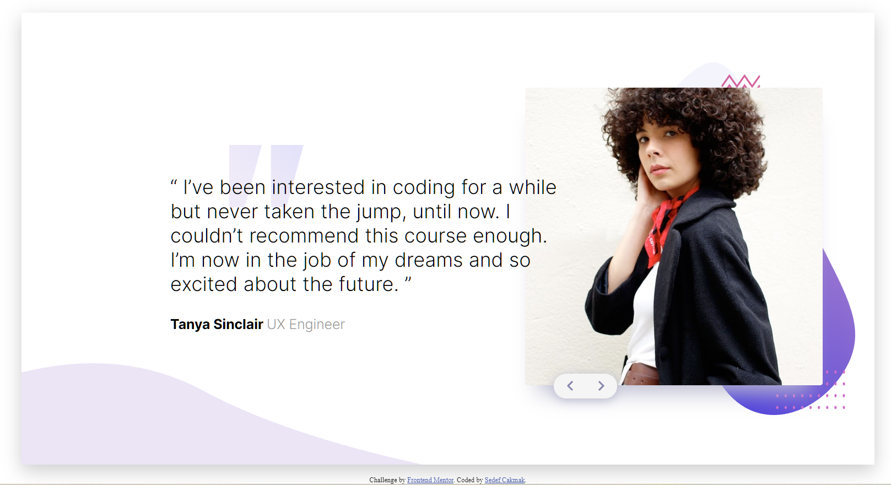

# Frontend Mentor - Coding bootcamp testimonials slider solution

This is a solution to the [Coding bootcamp testimonials slider challenge on Frontend Mentor](https://www.frontendmentor.io/challenges/coding-bootcamp-testimonials-slider-4FNyLA8JL).

## Table of contents

- [Overview](#overview)
  - [Screenshot](#screenshot)
  - [Links](#links)
- [My process](#my-process)
  - [Built with](#built-with)
  - [Continued development](#continued-development)
- [Author](#author)

## Overview

Coding Bootcamp Testimonials Slider done with HTML, LESS and Javascript.

### Screenshot

### Links

- Solution URL: https://github.com/sedcakmak/coding-bootcamp-testimonials-slider-master
- Live Site URL: https://sedcakmak.github.io/coding-bootcamp-testimonials-slider-master/

## My process

### Built with

- Semantic HTML5 markup
- LESS
- Flexbox

### Continued development

It's the first time I used Less in a project. I'd like to deepen my knowledge and especially delve into mixins in the next project.

## Author

- Github - [@sedcakmak](https://github.com/sedcakmak)
- Frontend Mentor - [@sedcakmak](https://www.frontendmentor.io/profile/sedcakmak)
